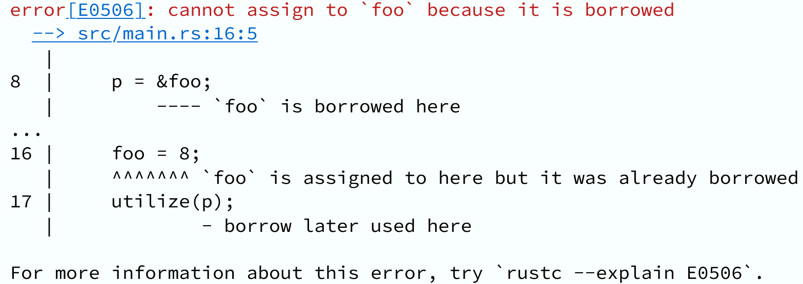
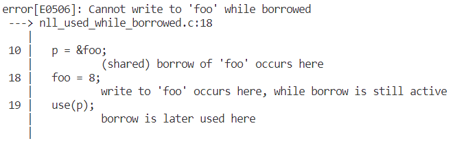

# Research Paper Code Repository

This repository contains the code implementation for the master's thesis [CORAL: a Rust-like Borrow Checker for C](https://hdl.handle.net/10216/153606) and the [LCTES'24](https://pldi24.sigplan.org/home/LCTES-2024) paper [Foundations for a Rust-Like Borrow Checker for C](https://dl.acm.org/doi/10.1145/3652032.3657579). The code provided here is meant to support the findings and experiments described in both works.

## Introduction

The C/C++ programming languages have been used for more than 50 years, and their popularity has not wavered. Being a de facto standard programming language, C is still used to maintain legacy code and to write new software, despite being prone to many vulnerabilities, including the lack of memory safety rules. Over the last decade, new languages adequate for low-level programming have risen as alternatives, such as Rust or Go.

A relevant portion of these vulnerabilities can be tackled by simply using a language that is type-safe, and whose compiler checks for memory and concurrency safety, such as Rust. However, learning a new language is a time-consuming task, and the transition of existing C codebases requires a significant effort to rewrite. Moreover, many traditional C compilation targets, such as the embedded systems market, are not yet ready to adopt Rust as a viable alternative, as they lack the build tools and libraries necessary to compiler to their hardware.

Source-to-source compilation allows the direct analysis and transformation of the original source code. This allows transformations to be composed upstream of the compiler. Through the use of this technique, it is possible to apply successive transformations to the source code whilst keeping it in the original language, which can be leveraged to preserve the correctness of the program, while approximating it to a desired set of non-functional properties and guarantees.  

CORAL (C Ownership with Rust-like Analysis and Lifetimes) is a prototype Borrow Checker implementing a subset of the analysis and transformations proposed in the master's thesis. It serves as a proof of concept of the core ideas presented, as well as a basis to further cover more of the Rust Borrow Checker features and C language constructs. It partially implements a source-to-source Borrow Checker for C, inspired by Rust's MIR Borrow Checker, capable of enforcing single ownership and strict pointer aliasing rules, in the form of borrowing. These rules are enforced through static analysis and the application of transformations to the source code. This allows us to approximate a subset of C to Rust's core concepts, applying the memory safety guarantees of the rustc compiler to C.

## Dependancies

- [Clava](https://github.com/specs-feup/clava)

## Results

One of the long-term goals for this research is to emit clear and informative error messages comparable to that of the rustc compiler. A direct comparison for a simple test scenario is shown below, with rustc on top and CORAL below.

